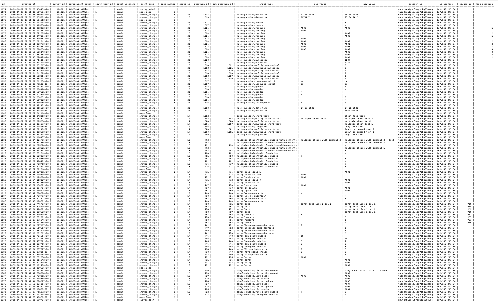

# Audit Log Table — Question Type Reference

This table describes how each LimeSurvey question type is represented in the `lime_user_audit_log` table for `answer_change` events.

Every row also carries `page_number` (the survey step the user was on when the change occurred), as well as `survey_id`, `participant_token`, `oauth_user_id`, `session_id`, and `ip_address` — these are the same for all question types and are omitted from the table below.

| LS Code | Description | `input_type` | `question_id` | `group_id` | `sub_question_id` | `column_id` | `rank_position` | `old_value` | `new_value` |
|---|---|---|---|---|---|---|---|---|---|
| **DB type** | — | `VARCHAR(50)` | `INTEGER` | `INTEGER` | `INTEGER` nullable | `INTEGER` nullable | `INTEGER` nullable | `TEXT` nullable | `TEXT` nullable |
| **Why** | — | Stores a readable category/type string instead of LimeSurvey's raw single-letter code — makes filtering and reporting possible without knowing internal codes | Every log row must know which question was touched — core reference | Identifies which question group the question belongs to — always set, mirrors the LimeSurvey group structure | Identifies the sub-field row in array/matrix questions and multi-field types (Q, K, M, P) | Identifies the column only for array types where columns are actual sub-questions stored in `lime_questions` (F, H, `:`, `;`) — other array types encode the choice in the value | Ranking positions are dynamic and shift as the user reorders — position is more meaningful than a static sub-question ID | The answer value before the change; `NULL` = no previous value | The answer value after the change; `NULL` = field was cleared or checkbox unchecked |
| `5` | Five-point choice | `single-choice/five-point-choice` | `1024` | `10` | — | — | — | `"1"` | `"3"` |
| `L` | List (radio) | `single-choice/list-radio` | `1024` | `10` | — | — | — | `"A"` | `"B"` |
| `O` | List with comment | `single-choice/list-with-comment` | `1024` | `10` | — | — | — | `"A"` | `"B"` |
| `!` | List (dropdown) | `single-choice/list-dropdown` | `1024` | `10` | — | — | — | `"A"` | `"B"` |
| `Y` | Yes / No | `mask-question/yes-no` | `1024` | `10` | — | — | — | `"Y"` | `"N"` |
| `G` | Gender | `mask-question/gender` | `1024` | `10` | — | — | — | `NULL` | `"M"` |
| `M` | Multiple choice (checkboxes) | `multiple-choice/multiple-choice` | `1024` | `10` | `1031` (which checkbox) | — | — | `NULL` | `"Y"` (checked) |
| `P` | Multiple choice with comments | `multiple-choice/multiple-choice-with-comments` | `1024` | `10` | `1031` (which checkbox) | — | — | `"Y"` | `NULL` (unchecked) |
| `S` | Short text | `text-question/short-text` | `1024` | `10` | — | — | — | `"Hello"` | `"Hello World"` |
| `T` | Long text | `text-question/long-text` | `1024` | `10` | — | — | — | `"Old text"` | `"New text"` |
| `U` | Huge text | `text-question/huge-text` | `1024` | `10` | — | — | — | `"Old"` | `"New"` |
| `Q` | Multiple short text | `text-question/multiple-short-text` | `1024` | `10` | `1031` (which sub-field) | — | — | `"Old"` | `"New"` |
| `D` | Date / Time | `mask-question/date-time` | `1024` | `10` | — | — | — | `"2026-04-01"` | `"2026-04-23"` |
| `I` | Language switch | `mask-question/language-switch` | `1024` | `10` | — | — | — | `"de"` | `"en"` |
| `K` | Multiple numerical | `mask-question/multiple-numerical` | `1024` | `10` | `1031` (which sub-field) | — | — | `"10"` | `"20"` |
| `N` | Numerical | `mask-question/numerical` | `1024` | `10` | — | — | — | `"42"` | `"43"` |
| `R` | Ranking | `mask-question/ranking` | `1024` | `10` | — | — | `2` (position) | `"A"` | `"B"` (item now at that position) |
| `\|` | File upload | `mask-question/file-upload` | `1024` | `10` | — | — | — | `NULL` | `"1"` (file count) |
| `X` | Boilerplate (display only) | `mask-question/boilerplate` | `1024` | `10` | — | — | — | *not logged* | *not logged* |
| `*` | Equation (computed) | `mask-question/equation` | `1024` | `10` | — | — | — | *not logged* | *not logged* |
| `1` | Array — dual scale | `array/dual-scale-0` or `array/dual-scale-1` | `1024` | `10` | `1031` (row) | — | — | `"2"` | `"4"` (scale in `input_type` suffix) |
| `A` | Array — five-point | `array/five-point-choice` | `1024` | `10` | `1031` (row) | — | — | `"3"` | `"5"` |
| `B` | Array — ten-point | `array/ten-point-choice` | `1024` | `10` | `1031` (row) | — | — | `"7"` | `"9"` |
| `C` | Array — yes/no/uncertain | `array/yes-no-uncertain` | `1024` | `10` | `1031` (row) | — | — | `"Y"` | `"U"` |
| `E` | Array — increase/same/decrease | `array/increase-same-decrease` | `1024` | `10` | `1031` (row) | — | — | `"I"` | `"S"` |
| `F` | Array — generic | `array/array` | `1024` | `10` | `1031` (row) | `1032` (col) | — | `"A"` | `"B"` |
| `H` | Array — by column | `array/by-column` | `1024` | `10` | `1031` (row) | `1032` (col) | — | `"3"` | `"4"` |
| `:` | Array — numbers | `array/numbers` | `1024` | `10` | `1031` (row) | `1032` (col) | — | `"10"` | `"15"` |
| `;` | Array — text | `array/text` | `1024` | `10` | `1031` (row) | `1032` (col) | — | `"foo"` | `"bar"` |

## Notes

**Why some array types have no `column_id` but others do:**
For five-point (`A`), ten-point (`B`), yes/no/uncertain (`C`), and increase/same/decrease (`E`), the "columns" are fixed scale options stored as answer options — the selected value IS the column, so no `column_id` is needed.
For generic array (`F`), by column (`H`), numbers (`:`), and text (`;`), the columns are real sub-questions stored in `lime_questions` with `scale_id = 1`, so they have their own `qid` that gets logged in `column_id`.

**Dual-scale arrays (type `1`):**
In LimeSurvey's database, the two scales of a dual-scale array are not stored as sub-questions in `lime_questions`. Instead, they are answer sets distinguished by `scale_id` (`0` = left scale, `1` = right scale) in `lime_answers`. Because there is no separate `qid` for each scale, `column_id` (which references `lime_questions`) cannot be used. The field name in LimeSurvey itself already encodes the scale as a `#0` or `#1` suffix (e.g. `123X1X100SQ001#0`), so we mirror that convention by appending `-0` or `-1` to the `input_type` string.

**Text fields are logged on blur, not per keystroke.**
`old_value` and `new_value` reflect the committed value when the user leaves the field, not intermediate typing state.

## Output of the Test with all question types

